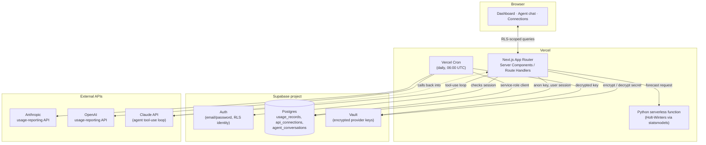

# Token Ledger

A multi-tenant dashboard for tracking AI API spend. Connect your own
Anthropic and OpenAI usage-reporting keys, get a cached spend dashboard,
Holt-Winters forecasts, anomaly detection, a "switch model" savings
simulator, a tool-using agent that answers questions about your own
usage data, and on-demand PDF/Excel reports. Inspired by Ramp's AI Token
Spend Management product.

**Stack:** Next.js 16 (App Router) · TypeScript · Supabase (Postgres,
Auth, Row Level Security, Vault) · Anthropic API (agentic tool use) · a
Python serverless function for forecasting · Vercel (hosting + Cron) ·
Recharts · Tailwind CSS

## Architecture

Two things never touch the browser directly: raw provider API keys and
the service-role Supabase client. Everything a signed-in user's own
session can reach goes through Postgres Row Level Security; everything
that must cross user boundaries (the sync cron, key encryption/decryption,
rate limiting) is confined to a small set of server-only code paths.



**Why this shape:**

- **RLS is the authorization boundary, not application code.** Every
  table a user's own session can reach has `auth.uid() = user_id` (or a
  join to it) as a Postgres policy. A Server Component that forgets a
  user filter still can't leak another user's rows — the database
  refuses the read at the connection level, independent of app code.
- **Provider keys are never stored in plaintext, and never leave the
  server.** A key is validated against the provider's own usage-reporting
  endpoint, then stored via `SECURITY DEFINER` Postgres functions wrapping
  Supabase Vault. Decryption is granted to the service role only — a
  regular authenticated session can write a secret but never read one back.
- **The service-role client that bypasses RLS is confined to a handful
  of server-only call sites** — the sync cron, the rate limiter, and
  connection cleanup — never anything that renders a page or handles a
  browser request.
- **The agent can only see what the signed-in user can see.** The Claude
  tool-use loop is handed the same RLS-scoped client the page itself uses,
  not the admin client, so even a successfully "jailbroken" agent has no
  database-level path to another user's data.

## Engineering highlights

A few decisions worth calling out:

- **Defense in depth on the agent, not just a system prompt.** Off-topic
  questions are filtered before a model call is even made, a scope-guard
  system prompt handles the rest, the tool schema exposes only read-only
  aggregation queries, and RLS is the backstop that holds even if every
  prompt-level guard is bypassed.
- **Every provider-spend and model-spend endpoint is rate-limited**
  through an atomic Postgres counter rather than an in-memory one, so the
  limit holds across serverless instances under concurrent requests.
- **Redirect targets are allow-listed, not blacklisted.** Post-auth
  redirects build an absolute URL by concatenating an untrusted path onto
  an origin with no trailing slash — a naive "starts with /" check still
  lets a value like `@evil.com` reassign the host. The validator instead
  only accepts a bare same-origin path.
- **A documented, non-default Content Security Policy**, with the
  trade-offs (why `script-src` needs `unsafe-inline` under Next's App
  Router streaming model, and why nonce-based CSP was rejected) explained
  in code rather than left implicit.
- **The sync pipeline is idempotent by construction** — a unique
  constraint plus an upsert means a retried or overlapping sync run
  reconciles cleanly instead of duplicating data.
- **Secrets used for authorization are compared in constant time**,
  closing a timing side-channel a plain string comparison leaves open.
- **On-demand reports have no fixed templates.** The agent builds a
  report spec live from the user's own words, and the report route
  independently re-validates every field server-side rather than trusting
  what the model produced.

## Project structure

```
src/
  app/               Next.js App Router: dashboard, auth pages, API routes
  components/        UI split by domain — auth, dashboard, marketing, shared primitives
  lib/
    agent/           Claude tool-use loop, tool definitions, prompts
    dashboard/       Pure aggregation functions over usage data
    ingestion/       Anthropic/OpenAI usage-API clients + normalization
    pricing/         Model pricing table and switch-model math
    reports/         PDF and Excel report builders
    supabase/        Three client constructors: browser, RLS-scoped server, service-role admin
    sync/            The background sync pipeline the cron route calls
api/forecast.py      Python serverless function (Holt-Winters forecasting)
supabase/            Schema, RLS policies, and encrypted-key/rate-limit SQL functions
```

## What it does

- **Connect a provider** — validates an Anthropic or OpenAI key against
  that provider's real usage-reporting endpoint before storing it.
- **Background sync** — a scheduled job refreshes usage data and key
  metadata for every connection automatically, no manual trigger.
- **Ask the agent** — a Claude-powered chat that answers questions about
  your own spend by calling real read-only tools against your data,
  streamed back token by token.
- **Forecasting** — a Holt-Winters model projects near-term spend with a
  confidence band from actual history.
- **Savings simulator** — compares the monthly cost of a real or
  hypothetical workload across different models.
- **Custom reports** — ask for a PDF or Excel export in plain English;
  built live from cached usage data for that specific request.
- **Demo mode** — a seeded account with synthetic usage data across both
  providers, so the product can be tried without a real key.

## Known limitations

- No automated test suite yet — correctness currently leans on
  TypeScript strict mode, linting, and manual verification.
- Live provider ingestion follows each provider's documented API shape
  but hasn't been exercised end to end against a real admin key; the
  synthetic-data path (used for the demo account) is the tested one.
- Fallback pricing is a hand-maintained table, not live-fetched from
  either provider.
