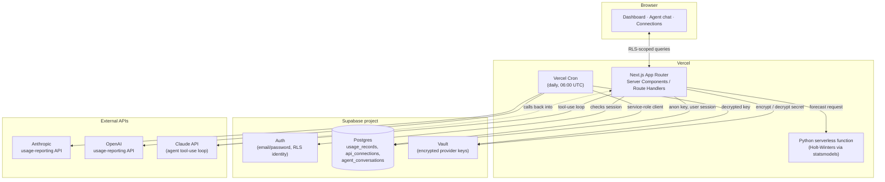

# Token Ledger

A multi-tenant dashboard for tracking AI API spend. Connect your own
Anthropic and OpenAI usage-reporting keys, get a cached spend dashboard,
Holt-Winters forecasts, anomaly detection, a "switch model" savings
simulator, a tool-using agent that answers questions about your own
usage data, and on-demand PDF/Excel reports. Inspired by Ramp's AI Token
Spend Management product.

**Stack:** Next.js 16 (App Router) · Supabase (Postgres, Auth, Row Level
Security, Vault) · Anthropic API (agentic tool use) · a Python serverless
function for forecasting · Vercel (hosting + Cron) · Recharts · Tailwind CSS

## Contents

- [Architecture](#architecture)
- [Engineering notes](#engineering-notes)
- [Project structure](#project-structure)
- [Local setup](#local-setup)
- [Environment variables](#environment-variables)
- [Core flows](#core-flows)
- [Known limitations](#known-limitations)
- [Deploying](#deploying)

## Architecture

Two things never touch the browser directly: raw provider API keys and
the service-role Supabase client. Everything a signed-in user's own
session can reach goes through Postgres Row Level Security; everything
that must cross user boundaries (the sync cron, key encryption/decryption,
rate limiting) is confined to a small set of server-only code paths.



**Why this shape:**

- **RLS is the authorization boundary, not application code.** Every
  table a user's own session can reach ([`supabase/schema.sql`](./supabase/schema.sql),
  [`supabase/agent_conversations.sql`](./supabase/agent_conversations.sql))
  has `auth.uid() = user_id` (or a join to it) as a Postgres policy. A
  Server Component that forgets a `.eq("user_id", ...)` filter still can't
  leak another user's rows — the database refuses the read at the
  connection level.
- **Provider keys are never stored in plaintext, and never leave the
  server.** [`addConnection`](./src/app/dashboard/connections/actions.ts)
  validates a key against the provider's own usage-reporting endpoint,
  then stores it via a `SECURITY DEFINER` Postgres function
  ([`supabase/vault_functions.sql`](./supabase/vault_functions.sql)) that
  wraps Supabase Vault. Decryption is granted to `service_role` only —
  `authenticated` can create a secret (write-only, gets back a UUID) but
  can never read one back.
- **The service-role client is confined to five files.**
  [`src/lib/supabase/admin.ts`](./src/lib/supabase/admin.ts) is the only
  place it's constructed; it's imported only by the cron sync route, the
  rate limiter, and connection cleanup on a failed insert — never by
  anything that renders a page or handles a browser request.
- **The agent can only see what the signed-in user can see.** The Claude
  tool-use loop ([`src/lib/agent/`](./src/lib/agent/)) is handed the same
  RLS-scoped Supabase client the page itself uses, not the admin client —
  so even a successfully "jailbroken" agent has no path to another user's
  data at the database level, independent of the prompt-level scope guard.

## Engineering notes

A few decisions worth calling out for anyone reviewing this as a code
sample, roughly in order of how much they shaped the design:

- **Defense in depth on the agent, not just a system prompt.** The chat
  endpoint fast-rejects obviously off-topic questions with a regex before
  spending a model call
  ([`isObviouslyOffTopic`](./src/lib/agent/prompts.ts)), a scope-guard
  system prompt handles the rest, the tool schema only exposes read-only
  aggregation queries, and — the layer that actually matters if the first
  three are ever bypassed — RLS means the tools can't return another
  user's rows no matter what the model is convinced to ask for.
- **Every provider-spend or model-spend endpoint is rate-limited**, via a
  Postgres function ([`supabase/rate_limit_functions.sql`](./supabase/rate_limit_functions.sql))
  rather than an in-memory counter, so the limit holds across Vercel's
  serverless instances and is atomic under concurrent requests. Key
  validation, the agent (billed to the developer's own Anthropic key, not
  the user's), and report generation each have their own threshold — see
  [`src/lib/rate-limit.ts`](./src/lib/rate-limit.ts).
- **Redirect targets are allow-listed, not blacklisted.** Both post-auth
  redirect points (`/login?next=`, `/auth/confirm?next=`) build an
  absolute URL by concatenating an untrusted path onto an origin with no
  trailing slash — a naive `next.startsWith("/")` check still lets
  `@evil.com` or `.evil.com` reassign the host. [`safeNextPath`](./src/lib/safe-redirect.ts)
  instead only ever accepts a single leading slash with no second slash
  or backslash after it.
- **A documented, non-default Content Security Policy.** [`next.config.ts`](./next.config.ts)
  explains in-line why `script-src` needs `unsafe-inline` (Next's App
  Router streams per-request inline scripts that a static hash allowlist
  can never match — nonce-based CSP was tried and rejected because it
  forces every route into dynamic rendering) rather than pasting a
  generic template.
- **The sync pipeline is idempotent by construction.** `usage_records`
  has a `unique(connection_id, date, model)` constraint and the cron sync
  ([`syncConnection.ts`](./src/lib/sync/syncConnection.ts)) always
  `upsert`s on that key, so a retried or overlapping cron run reconciles
  cleanly instead of duplicating rows.
- **Secrets used for authorization are compared in constant time.** The
  cron route hashes both the presented and expected bearer token before
  `timingSafeEqual` ([`src/app/api/cron/sync/route.ts`](./src/app/api/cron/sync/route.ts)),
  since a plain `!==` leaks how many leading bytes matched via response
  timing, and a bare length check ahead of `timingSafeEqual` would leak
  the secret's length on its own.
- **On-demand reports have no fixed templates.** [`generate_report`](./src/lib/agent/tools.ts)
  is a real tool the agent calls with a spec built live from the user's
  own words (metrics, grouping, date range, comparison mode); [`/api/reports/custom`](./src/app/api/reports/custom/route.ts)
  independently clamps every one of those inputs server-side (day count,
  metric count, moving-average window) rather than trusting what the
  model decided to put in the URL.

## Project structure

```
src/
  app/
    api/               Route Handlers: agent chat (SSE stream), cron sync,
                        custom report generation, conversation CRUD, health
    auth/confirm/       Email confirmation / password-recovery landing route
    dashboard/          The authenticated app: overview, charts, connections,
                        agent chat, simulator — Server Components by default
    login/, signup/,
    reset-password/     Auth pages (the UI is a shared modal, see
                        components/auth/AuthOverlay.tsx)
  components/
    auth/               Login/signup/reset forms + the overlay that hosts them
    dashboard/          Provider badges/icons, sidebar nav
    marketing/          Landing page sections
    ui/                 Small shared primitives (Button, Card, Field, Alert)
  lib/
    agent/              Claude tool-use loop, tool definitions, prompts,
                        conversation persistence, SSE client hook
    dashboard/          Pure aggregation functions over usage_records rows
                        (spend by model/provider/day, anomaly detection,
                        the savings simulator's workload math)
    forecast/           Client for the Python forecasting function
    ingestion/          Anthropic/OpenAI usage-API clients + response
                        normalization, plus synthetic generators for the demo
    pricing/            Manually-maintained $/M-token table, switch-model math
    providers/          Provider metadata, key-format validation
    reports/            PDF (pdfkit) and Excel (exceljs) report builders
    supabase/           Three Supabase client constructors: browser, RLS-scoped
                        server, and service-role admin — see the docstring on
                        each for when to use which
    sync/               The actual sync pipeline the cron route calls
    rate-limit.ts        Shared rate-limit helper (backed by a Postgres RPC)
    safe-redirect.ts      Allow-list validator for post-auth redirect targets
  proxy.ts               Next.js middleware entry point: session refresh +
                        route protection (src/lib/supabase/middleware.ts)
api/forecast.py          Vercel Python serverless function (Holt-Winters)
supabase/                Hand-run SQL: schema + RLS policies, Vault wrapper
                        functions, rate-limit function, agent chat tables
scripts/seed-demo-account.ts   Seeds a demo account with synthetic usage data
```

## Local setup

1. Node 22 (`.nvmrc` pins this — `nvm use` if you have nvm).
2. `npm install`
3. Copy `.env.local.example` to `.env.local` and fill in:
   - `NEXT_PUBLIC_SUPABASE_URL` / `NEXT_PUBLIC_SUPABASE_ANON_KEY` /
     `SUPABASE_SERVICE_ROLE_KEY` — from your Supabase project's
     Settings → API page.
   - `ANTHROPIC_API_KEY` — from console.anthropic.com. This powers the
     agent features server-side; end users never provide their own.
   - `NEXT_PUBLIC_APP_URL` — e.g. `http://localhost:3000` for local dev.
   - `CRON_SECRET` — any long random value (`openssl rand -hex 32`);
     authenticates Vercel Cron's calls to the background sync route.
4. In the Supabase SQL editor, run, in order:
   1. [`supabase/schema.sql`](./supabase/schema.sql) — core tables
      (`api_connections`, `usage_records`) and their RLS policies.
   2. [`supabase/vault_functions.sql`](./supabase/vault_functions.sql) —
      `SECURITY DEFINER` wrappers around Supabase Vault for storing and
      decrypting connected provider keys.
   3. [`supabase/rate_limit_functions.sql`](./supabase/rate_limit_functions.sql) —
      the atomic rate-limit counter used by key validation, the agent, and
      report generation.
   4. [`supabase/agent_conversations.sql`](./supabase/agent_conversations.sql) —
      chat history tables for the Ask Agent page.

   Already have an older version of `api_connections`? The `alter table
   ... add column if not exists` block at the bottom of `schema.sql` is
   safe to re-run by itself instead of the whole file.
5. `npm run dev`, then visit `/api/health` to confirm the app can reach
   Supabase.

Optional — seed a demo account with synthetic usage data across both
providers (see [Core flows](#core-flows) below):

```
npm run seed:demo
```

## Environment variables

| Variable | Where it's used | Notes |
|---|---|---|
| `NEXT_PUBLIC_SUPABASE_URL` | Client + server | Public by design (Supabase's anon-key model) |
| `NEXT_PUBLIC_SUPABASE_ANON_KEY` | Client + server | RLS-scoped; safe to expose |
| `SUPABASE_SERVICE_ROLE_KEY` | Server only | Bypasses RLS — never imported outside `src/lib/supabase/admin.ts` and its five call sites |
| `ANTHROPIC_API_KEY` | Server only | Bills the developer's account, not the end user's |
| `NEXT_PUBLIC_APP_URL` | Server only | Used for the server-side fetch to the Python forecast function |
| `CRON_SECRET` | Server only | Vercel Cron sends this as a Bearer token automatically once set in the project's env vars |

## Core flows

**Connecting a provider.** `/dashboard/connections` accepts an
Anthropic or OpenAI key and validates it against that provider's actual
usage-reporting endpoint before storing anything — both providers require
an **org/Admin-level** key for usage data, not a regular per-project key,
and the form surfaces that distinction if validation fails. The real
ingestion clients ([`src/lib/ingestion/{anthropic,openai}.ts`](./src/lib/ingestion))
are built against each provider's documented response shape; if a live
sync ever fails or looks wrong, the thrown error carries the raw response
body to make the field-mapping fix fast.

**Background sync.** `vercel.json` schedules `GET /api/cron/sync` daily
at 06:00 UTC — Vercel's Hobby plan caps cron at once/day; a tighter
schedule needs Pro/Enterprise. The route walks every connection across
every user with the service-role client, re-fetches usage records and the
key's own metadata (name, status, owner — matched back via its redacted
hint, since neither provider ever returns a full key value) from the
provider's admin API, and upserts. There is no manual "sync now" button;
a connected key gets hit on this schedule automatically.

**The agent.** `/dashboard/agent` and the dashboard's briefing panel both
run a Claude tool-use loop ([`src/lib/agent/claude.ts`](./src/lib/agent/claude.ts)),
streamed to the client as Server-Sent Events. The model has six read-only
tools over `usage_records` (spend by model/provider/day, period
comparison, moving averages, a specific day's breakdown, and on-demand
report generation) and nothing else — it can query and summarize, not
mutate anything. Chat history persists per-conversation in Postgres.

**Forecasting.** The dashboard's spend chart layers a Holt-Winters
projection with a confidence band ([`api/forecast.py`](./api/forecast.py))
on top of actual history, computed by a separate Python serverless
function using `statsmodels`, called server-side from the Next.js app.

**Savings simulator.** `/dashboard/simulator` takes either a real workload
pulled from `usage_records` or hand-typed token counts, and shows the
monthly cost difference of running the same volume through a different
model, using the manually-maintained pricing table in
[`src/lib/pricing/models.ts`](./src/lib/pricing/models.ts).

**Custom reports.** Ask the agent for a PDF or Excel export of any metric
combination, grouping, or date range in plain English; it's built live
for that specific request from cached `usage_records`, not picked from a
fixed set of report templates.

**Demo account.** `npm run seed:demo` creates or refreshes a shared demo
account seeded with synthetic (not real) usage across both providers, so
the app can be tried without connecting a real key. Credentials aren't
published here or on the landing page — the demo account's agent features
call the developer's own Anthropic key, so a public login would be a real
cost-abuse vector even with rate limiting in place. Re-running the seed
script is safe (it upserts rather than duplicating), and
`npm run seed:demo -- --rotate` rotates the account's password.

## Known limitations

Being upfront about what this build doesn't cover:

- **No automated test suite.** Correctness currently relies on TypeScript's
  type system, `strict` mode, ESLint, and manual verification — there's
  no unit or integration test runner wired up yet.
- **Live provider ingestion is unverified against a real Admin key.** The
  Anthropic/OpenAI clients are built strictly to each provider's
  documented usage-API response shape, but this project hasn't been
  exercised against a live org-Admin key end to end; the synthetic
  generators used for the demo account are the actual tested path.
- **Single-region, single rate-limit table.** Fine at this project's
  scale; a production system with real multi-tenant load would want
  per-region rate limiting and a background job queue instead of a
  sequential loop in the cron route.
- **Cost fallback pricing is hand-maintained**, not live-fetched from
  either provider — see the sourcing note at the top of
  [`src/lib/pricing/models.ts`](./src/lib/pricing/models.ts).

## Deploying

Push to GitHub, import the repo into Vercel, and set the same environment
variables (above) in the Vercel project's settings — including
`CRON_SECRET`, which Vercel then sends automatically as a Bearer token
on its scheduled call to `/api/cron/sync`.
